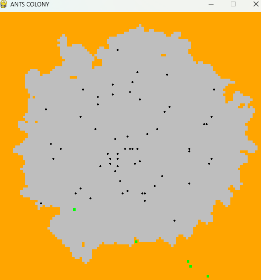

# Ant Colony Simulation

This project is a simple ant colony simulation built with Python and Pygame. Ants roam around the environment, leave pheromone trails, and search for food, mimicking basic behaviors observed in real ant colonies.

## Features

- Ants move randomly but are influenced by pheromone trails.
- Food sources attract ants and are consumed upon contact.
- Pheromones decay over time, simulating realistic behavior.
- Modular structure with separate files for logic and rendering.

## Screenshots

 

